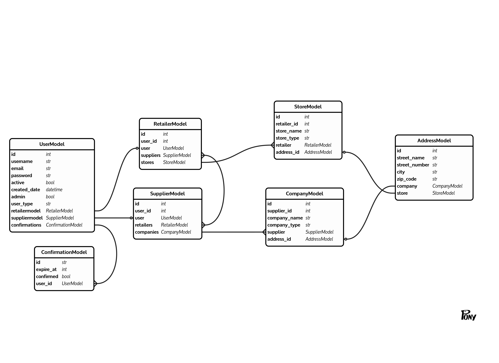

# SupplyIt
> Order Management System built with microservices

[](https://travis-ci.com/argipap/SupplyItCodeBase)

### Prerequisites

* [docker](https://docs.docker.com/get-started/)
* [docker-compose](https://docs.docker.com/compose/gettingstarted/)
* [docker-machine(optionally)](https://docs.docker.com/machine/overview/)
* [node](https://nodejs.org/en/)
* [npm](https://www.npmjs.com/)

##### After installation you may check versions with:
```
$ docker -v
Docker version 19.03.5, build 633a0ea838
$ docker-compose -v
docker-compose version 1.25.0, build 0a186604
$ npm -v
6.13.4
$ node -v
v13.6.0
```


## Getting started
**Below instructions are for local dev use!!** 

Clone the repo:

```
git clone https://github.com/argipap/SupplyItCodeBase.git
```

Export environmental variables:

```
export REACT_APP_USERS_SERVICE_URL=http://localhost
export MAILGUN_API_KEY=yourMailgunAPIKey
export MAILGUN_DOMAIN=yourMailgunAPIDomain
```

Update swagger specification:
```
python services/swagger/update-spec.py http://localhost
```

From the project's root folder run the command:

```
docker-compose up -d --build
```

Check running containers:

```
docker ps
```

Check logs:

```
docker-compose logs {service_name}, e.g docker-compose logs supplyit-users
```

#### Create database

```
docker-compose exec supplyit-users python manage.py recreate_db
```

#### Seed database with some users

```
docker-compose exec supplyit-users python manage.py seed_db
```

#### Run tests, test coverage and linter for users service

```
docker-compose exec supplyit-users python manage.py test
docker-compose exec supplyit-users python manage.py cov
docker-compose exec supplyit-users flake8 project
```

#### Run tests and test coverage for frontend service

```
docker-compose exec client npm run tests
docker-compose exec client npm run coverage
```

#### Run e2e tests with cypress

```
./node_modules/.bin/cypress open --config baseUrl=http://localhost
```

## Users DB schema



## AWS Deployment

TO BE DOCUMENTED ...

## Development workflow (if services have been deployed on AWS)

####Development:

* Create a new feature branch from the master branch
* Make an arbitrary change; commit and push it up to GitHub
* After the build passes, open a PR against the development branch to trigger a new build on Travis
* Merge the PR after the build passes

####Staging:

* Open PR from the development branch against the staging branch to trigger a new build on Travis
* Merge the PR after the build passes to trigger a new build
* After the build passes, images are created, tagged staging, and pushed to ECR,
revisions are added to the Task Definitions, and the Service is updated

####Production:

* Open PR from the staging branch against the production branch to trigger a new build on Travis
* Merge the PR after the build passes to trigger a new build
* After the build passes, images are created, tagged production, and pushed to ECR,
revisions are added to the Task Definitions, and the Service is updated
* Merge the changes into the master branch


## Built With

* [flask](https://www.palletsprojects.com/p/flask/) - The web framework used
* [nginx](https://docs.nginx.com/nginx/admin-guide/web-server/reverse-proxy/) - Reverse proxy (for local development)
* [react](https://reactjs.org/) - Frontend javascript library used
* [travis](https://travis-ci.com/) - CI tool used
* [aws](https://aws.amazon.com/) - Cloud Computing Services for staging and production environments
 ([EC2](https://aws.amazon.com/ec2/),
 [ECR](https://aws.amazon.com/ecr/), 
 [ECS](https://aws.amazon.com/ecs/), 
 [ALB](https://aws.amazon.com/elasticloadbalancing/), 
 [RDS](https://aws.amazon.com/rds/))
* [mailgun](https://www.mailgun.com/) - Third party app for sending emails